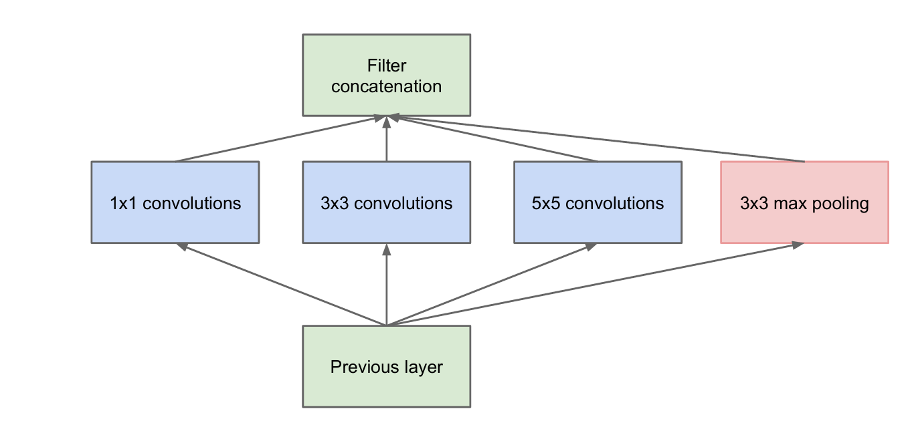
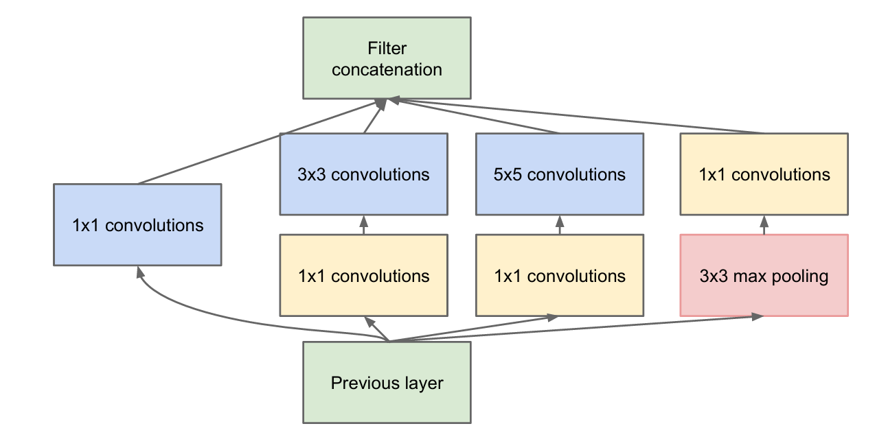
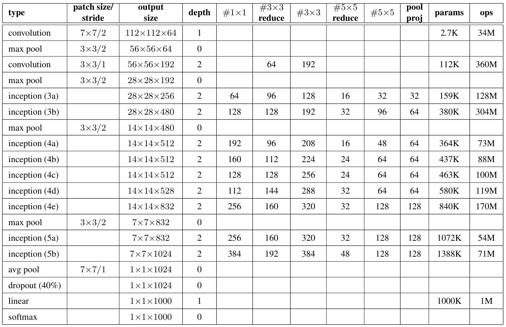
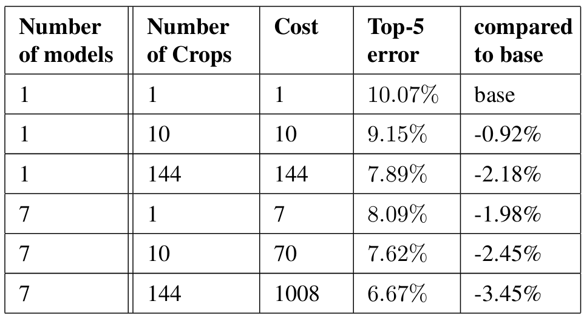

# GoogleNet 学习笔记

[代码学习](./inception_impl/inception.ipynb)

## 1. 研究背景与动机

### 研究背景

* 2012-2014年，**目标分类和检测**任务**发展迅猛。这不仅源于硬件性能与模型参数量的提升，更来自**新的设计思想与网络结构**。
* 随着**移动和嵌入式计算**兴起，算法的功耗、内存使用等效率指标得到越来越多的重视

### 研究动机

研究者希望在提升模型性能的同时考虑计算效率，以适配**实际使用的情境**，提出了GoogleNet(Inception v1)架构

### 研究基础

GoogleNet 的研究基础建立在深层卷积神经网络（如AlexNet、VGG）取得显著进展的前提下，同时吸取了NiN（Network in Network）以及部分稀疏理论研究的思想。

## 2. 已有研究分析

### 2.1 经典CNN的发展提供设计基础

* 增加层数
* 增加层宽度(特征图通道数)
* 使用 `Dropout`避免过拟合

### 2.2 最大池化层的作用在多种任务中被证明

### 2.3 生物视觉启发的多尺度滤波器组合辅助多尺度处理

Serre 等人模仿生物视觉皮层的模型，使用多种尺寸的Gabor滤波器来处理多尺度问题。作者使用了类似的处理，但实现了**可学习的滤波器**而非固定的模型。

> **Gabor滤波器**是一种线性滤波器，本质上是一个高斯函数与正弦波的乘积。它能够在空间和频率两域上实现局部化，对特定方向、频率的特征（如边缘、纹理）有良好响应。其数学表达式为：
>
> $$
> G(x, y; \lambda, \theta, \psi, \sigma, \gamma) = \exp\left( -\frac{x'^2 + \gamma^2 y'^2}{2\sigma^2} \right) \cos\left( 2\pi \frac{x'}{\lambda} + \psi \right)
> $$
>
> 其中，$(x',y')$是旋转坐标，$\lambda$为波长（控制频率），$\theta$为方向，$\psi$为相位偏移，$\sigma$为高斯包络宽度，$\gamma$为空间纵横比。Gabor滤波器因其与生物视觉系统感受野的高相似性，被广泛用于图像边缘检测、纹理分析等领域。
>
> Serre等人的工作中，采用了一组不同尺度和方向的Gabor滤波器，对输入图像进行多通道的特征提取，再将结果进行池化与非线性处理，组合成更加抽象和复杂的特征表示。

### 2.4 Network in Network启发1x1卷积层设计

Lin 等人在网络结构中添加1x1卷积层，以增加网络深度。

在GoogleNet中，作者添加了相似的1x1卷积层，并且除了增加网络深度，也用于**减少维度来避免计算瓶颈**

### 2.5 已有的SOTA目标检测方法(R-CNN)作为pipeline基础

> **R-CNN (Regions with Convolutional Neural Networks)** 是Girshick等人于2014年提出的目标检测方法，它将目标检测问题分解为两个独立的子问题：**区域提议（Region Proposal）**和**区域分类（Region Classification）**。
>
> **核心思想**：传统的滑动窗口方法需要在图像的各个位置和尺度上穷举搜索，计算量巨大。R-CNN采用"先提议后分类"的策略，先利用传统计算机视觉方法（如Selective Search）快速生成约2000个可能包含目标的候选区域，再对这些区域进行精确分类。
> **两阶段设计的优势**：第一阶段利用传统方法的高效性快速筛选候选区域，第二阶段利用深度CNN的强大表征能力进行精确分类。这种"分而治之"的策略结合了传统计算机视觉方法在边界框定位上的准确性，以及深度学习在语义理解上的优势。

在GoogLeNet的检测任务中，作者采用了类似的两阶段pipeline，但做了两处关键改进：

- **改进区域提议**：将Selective Search与Multi-box预测结合，用60%的提议数量达到了更高的覆盖率（92%→93%）
- **替换分类器**：用计算高效的Inception模块替代传统CNN（如AlexNet），在减少参数量的同时提升了分类准确率

## 3. 研究动机

### 3.1 直接增大网络的两大问题

提升深度神经网络性能最直接的方法是增加**深度**（层数）和**宽度**（每层单元数/滤波器数量）。但存在两个主要缺点：

#### 过拟合风险

更大的网络意味着更多参数，在训练数据有限时更容易**过拟合**

#### 计算资源爆炸

* 当两个卷积层级联时，均匀增加滤波器数量会导致计算量**二次增长**
* 如果增加的容量使用效率低，则大量计算被浪费

### 3.2 解决方案

引入**稀疏性（Sparsity）**：用稀疏连接替代全连接，以及在卷积内部也引入稀疏性。

#### 理论基础

“如果数据集的概率分布可以用一个大型、非常稀疏的深度神经网络表示，那么**最优网络拓扑可以逐层构建**，通过分析前一层激活的**相关性统计**，将**高度相关的神经元聚类**在一起形成下一层的单元。”

### 3.3 挑战

* 现代计算基础设施在这种结构的计算非常低效
* **查找和缓存未命中**的开销占主导地位

### 3.4 Inception架构 （折中方案）

* **核心思想**：**通过密集矩阵适配稀疏结构**

具体而言，Inception模块通过**密集矩阵计算**来近似理论上最优的稀疏结构，实现"滤波器级稀疏" + "密集计算"的结合。

**Inception作为案例研究**：Inception架构最初作为一个案例研究，目标是评估用密集组件近似视觉网络稀疏结构的可行性。早期实验显示相比于基于Network-in-Network的参考网络有适度收益，经过调整后差距扩大，在定位和目标检测任务中特别有效。

## 4. Inception架构设计

### 4.1 设计思路

**目标**：找到最优的局部构造，然后在空间上重复（基于平移不变性）

**方法**：

* **低层**（靠近输入）：相关单元集中在局部区域 → **1×1卷积**
* **中等分布**：聚类在空间上更分散 → **3×3卷积**
* **稀疏分布**：聚类分布更广 → **5×5卷积**
* **池化路径**：对卷积网络成功至关重要，添加并行池化路径

### 4.2 朴素版Inception模块

**结构**：四条并行路径

**问题**：计算代价高昂

* 5×5卷积在大量滤波器上计算昂贵
* 池化后输出滤波器数量等于前一阶段，导致阶段间滤波器数量不可避免增加
* 几个阶段后会**计算爆炸**

### 4.3 改进：1×1卷积降维

**核心想法**：在计算需求过度增长的地方降维

**改进后的结构**：

**1×1卷积的双重作用**：

* **降维**：在昂贵的3×3和5×5卷积之前减少计算
* **非线性**：包含ReLU激活，增加表达能力

### 4.4 整体网络设计

**Inception网络** = Inception模块堆叠 + 偶尔插入stride=2的max-pooling

**关键优势**：

* 显著增加单元数量，不会导致计算复杂度失控
* 视觉信息在各种尺度上处理，然后聚合
* 性能相似的网络比非Inception架构快**3-10倍**

## 5. GoogLeNet网络结构

### 5.1 总体架构

GoogLeNet是Inception架构在ILSVRC 2014竞赛中的具体实现。

$ \# 3 \times 3$ reduce 代表3x3卷积前的1x1降维卷积核的数量
$ \# 3 \times 3$ 代表3x3卷积核的数量

### 5.2 辅助分类器（Auxiliary Classifiers

#### 结构设计

在**Inception (4a)** 和 **Inception (4d)** 的输出上分别添加辅助分类器：

1. **Average pooling**（5×5, stride=3）
   * (4a)输出：4×4×512
   * (4d)输出：4×4×528
2. **1×1卷积**（128个滤波器）+ ReLU激活（降维）
3. **全连接层**（1024个单元）+ ReLU激活
4. **Dropout**（70%丢弃率）
5. **Softmax线性层**（预测1000类）

#### 训练与推理

* **训练时**：辅助分类器的损失以**0.3的权重**加到总损失中
* **推理时**：辅助分类器不使用
* **实验发现**：辅助分类器的效果相对较小（约0.5%），只需一个就能达到相同效果

### 5.5 激活函数

所有卷积层使用**ReLU激活函数**

## 6. 训练方法

### 6.1 训练基础设施
使用Google的DistBelief分布式机器学习系统

### 6.2 优化器配置
**异步随机梯度下降**：
* **优化算法**：异步SGD
* **动量（Momentum）**：0.9
* **学习率调度**：固定调度策略
  * 每8个epoch降低学习率4%
* **模型集成**：使用**Polyak平均**创建推理时的最终模型

> **Polyak平均**（也称为指数移动平均）：在训练过程中维护参数的移动平均值，而非直接使用最后一次迭代的参数。这种方法可以得到更稳定、泛化性能更好的模型。数学表达式为：
> $$
> \theta_{\text{avg}}^{(t)} = \beta \theta_{\text{avg}}^{(t-1)} + (1-\beta)\theta^{(t)}
> $$
> 其中$\theta^{(t)}$是第$t$步的参数，$\beta$是衰减率（通常接近1，如0.999）。

### 6.3 数据增强策略

#### 图像采样方法
* 均匀分布在原图像面积的**8%到100%**之间
* 限制在区间$[\frac{3}{4}, \frac{4}{3}]$内
* 不同模型在不同相对裁剪尺寸上训练

#### 光度畸变（Photometric Distortions）

采用Andrew Howard提出的光度畸变技术来对抗训练数据成像条件的过拟合：

* 随机调整亮度、对比度、饱和度
* 随机改变色调
* 增强模型对不同光照条件、相机设置的鲁棒性

### 6.4 模型集成（Ensemble）

**ILSVRC 2014提交方案**：

* **模型数量**：7个GoogLeNet版本的集成
* **模型差异**：
  * 6个模型使用相同架构
  * 1个模型使用更宽更深的版本（质量略优但对集成提升有限）
* **集成方式**：简单的预测概率平均

**训练一致性**：

* 所有模型使用**相同的初始权重**
* 仅通过**随机性**（采样方法、图像顺序）产生差异
* 这种"有限多样性"仍能带来显著的集成增益

## 7. ILSVRC 2014分类任务结果

### 7.1 任务设置

**评估指标**：

* **Top-1准确率**
* **Top-5错误率**

### 7.2 测试策略

#### 7.2.1 模型集成 （6.4）

#### 7.2.2 多尺度多裁剪测试

**尺度选择**：将图像调整到4个尺度，短边分别为**256, 288, 320, 352**像素

**空间裁剪**：对于横向图像：取**左、中、右**三个正方形; 对于纵向图像：取**上、中、下**三个正方形

**每个正方形的处理**：
* 4个角的224×224裁剪
* 中心的224×224裁剪
* 整个正方形缩放到224×224
* 所有裁剪的镜像

**总裁剪数**：$4 \times 3 \times 6 \times 2 = 144$个裁剪/图像

#### 7.2.3 预测聚合
* 对同一图像的多个裁剪取softmax概率的平均值
* 对所有分类器的预测取平均值

### 7.3 主要结果

#### 最终成绩
**Top-5错误率**：**6.67%**
**竞赛排名**：**第1名**

### 7.4 消融实验

> **单模型选择**：当使用单个模型时，选择验证集上top-1错误率最低的模型。

#### 关键发现

1. **多裁剪测试的收益**：
   * 从1个裁剪到10个裁剪：提升0.92%
   * 从10个裁剪到144个裁剪：额外提升1.26%
   * 边际收益递减，但仍然显著

2. **模型集成的收益**：
   * 从1个模型到7个模型（单裁剪）：提升1.98%
   * 集成效果与多裁剪相当

3. **组合效果**：
   * 集成 + 多裁剪的组合效果最佳
   * 总提升3.45%

4. **计算成本权衡**：
   * 最终配置计算成本是基线的1008倍
   * 在实际应用中需要根据延迟要求和资源限制进行权衡

### 7.5 实际应用考量
单模型 + 少量裁剪（如10个）的配置,相比完整配置性能下降不大，但速度快约14倍,适合对延迟敏感的实际应用场景

## 8. ILSVRC 2014目标检测任务结果

### 8.1 任务设置

ILSVRC检测任务要求在图像中生成目标的边界框，涵盖200个可能的类别。检测结果的正确性判定需要同时满足两个条件：检测框的类别与ground truth一致，且边界框重叠度（使用Jaccard指数衡量）至少达到50%。多余的检测框被视为假阳性并受到惩罚。与分类任务不同，每张图像可能包含多个目标或无目标，且目标尺度变化很大。任务使用**mAP（mean Average Precision，平均精度均值）**作为评估指标。

> **Jaccard指数**（也称IoU, Intersection over Union）衡量两个边界框重叠程度，计算公式为：
> $$
> \text{IoU} = \frac{\text{Area of Overlap}}{\text{Area of Union}} = \frac{|A \cap B|}{|A \cup B|}
> $$
> 其中$A$和$B$分别表示预测框和真实框。IoU ≥ 0.5是判定检测正确的常用阈值。

### 8.2 检测方法

GoogLeNet的检测方法采用了类似R-CNN的pipeline，但进行了关键改进。首先，用**Inception模型**替代R-CNN中的传统CNN作为区域分类器，这带来了更高的分类准确率和更少的参数量。

在区域提议阶段，作者采用了**Selective Search与Multi-box混合**的策略。具体做法是将Selective Search的超像素尺寸增大为原来的2倍，这使得提议数量减半，然后添加200个来自Multi-box的区域提议进行补充。最终提议数量约为R-CNN的60%，但覆盖率反而从92%提升到93%。这一改进为单模型带来了约1%的mAP提升。

> **Multi-box**是一种基于深度神经网络的目标边界框预测方法，可以直接预测多个高质量的边界框，与传统的Selective Search形成互补。

在推理阶段使用了**6个GoogLeNet模型的集成**，将准确率从40%提升到43.9%。值得注意的是，由于时间限制，作者并未使用**边界框回归**技术，这暗示性能还有进一步提升空间。

### 8.3 主要结果与分析

GoogLeNet在ILSVRC 2014检测任务中取得了**43.9%的mAP**，获得第一名。从历年进步来看，2013年到2014年检测准确率几乎翻倍（从22.6%到40%+），所有顶尖团队都转向使用卷积神经网络，而GoogLeNet相比第二名CUHK DeepID-Net（40.7%）提升了3.2个百分点。

### 8.4 架构优势的进一步证明

论文特别指出，GoogLeNet的检测结果在**不利用上下文信息、不进行边界框回归**的情况下仍具有竞争力，这为Inception架构的优势提供了进一步的证据。预期类似质量的结果也可以通过更昂贵的非Inception类型的同等深度和宽度网络实现，但作者的方法提供了确凿的证据，表明向**稀疏架构**转变是可行且有用的想法。

从通用性角度来看，Inception架构在分类任务（6.67%错误率）和检测任务（43.9% mAP）上都取得了第一名的成绩，同一架构无需针对特定任务进行大幅修改就能适配不同任务，这证明了设计思想的**普适性**。

# 9.总结
### 9.1 核心创新

GoogLeNet的核心贡献是提出了**Inception架构**。Inception模块在同一层级并行使用1×1、3×3、5×5三种卷积核以及max pooling，实现**多尺度信息融合**。通过在大卷积核前引入1×1卷积**降维**，在增加网络宽度和深度的同时避免了计算量爆炸。GoogLeNet参数量仅为AlexNet的**1/12**，却在准确率上显著提升，充分证明了架构的效率优势。

### 9.2 理论基础

Inception架构基于Arora等人的稀疏神经网络理论：通过分析层间激活的**相关性统计**聚类神经元。但稀疏结构在现代硬件上执行效率低，Inception是这一矛盾下的折中思想。

### 9.3 设计启示

GoogLeNet证明了**精巧设计可以超越粗暴堆叠**。论文强调**计算预算**约束（15亿次乘加运算），确保模型实际可部署。Inception架构在分类和检测任务上的成功验证了其**通用性**，开启了通过**架构创新**提升性能的新方向，为后续的高效网络设计和神经架构搜索奠定了基础。