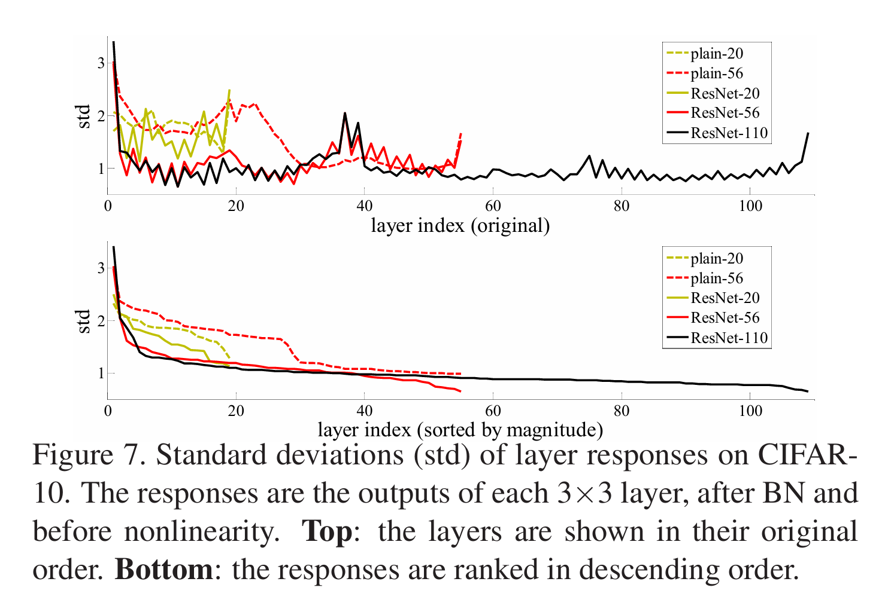
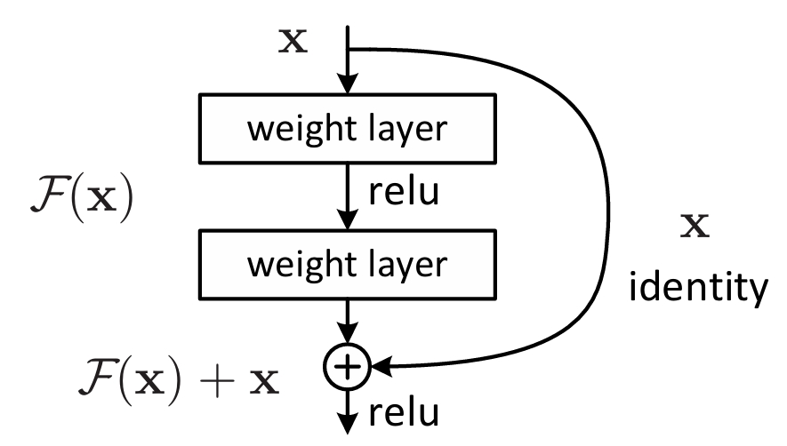
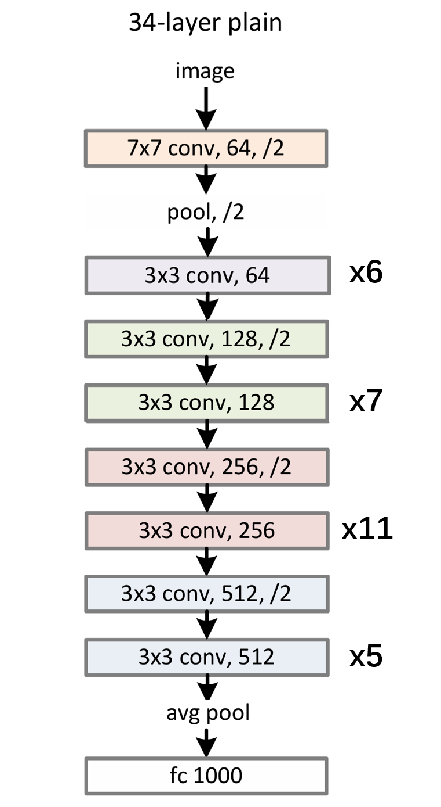
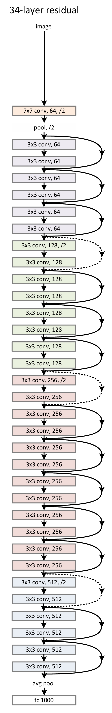

# ResNet 学习笔记

## 核心贡献
通过引入残差学习框架和跳跃连接，让深层网络学习"残差"（$\mathcal{F}(x) = \mathcal{H}(x) - x$）而非直接学习目标映射，从而解决了深度网络随层数增加反而性能下降的退化问题，使得训练超深网络成为可能。

## 1. 研究背景与动机

### 1.1 研究背景
深度卷积神经网络在**图像分类**任务上取得了一系列突破性成果。早期阻碍深度网络训练的**梯度消失/爆炸**问题已通过**归一化初始化**和**中间归一化层**基本解决。

但同时，一个**退化问题 (Degradation Problem)** 出现：

* 随着网络深度增加，准确率先达到饱和，然后**迅速退化**。这种退化不是由过拟合引起的，而是向单纯向模型添加更多层导致

**矛盾**：
从构造的角度看，更深的网络可以被设计为一个较浅的网络加上一些恒等映射层，即**深层网络可能的解理论上应该包含浅层网络的解**，因此更深的模型不应该产生比浅层模型更高的训练误差。但实验表明当前的求解器无法找到这样的解。

### 1.2 残差学习

为了解决上述问题，作者提出让网络学习残差映射

#### 核心思想

不让堆叠层直接拟合期望的底层映射 $\mathcal{H}(x)$，而是**让它们拟合残差映射**

$$
\mathcal{F}(x) := \mathcal{H}(x) - x
$$

此时原始映射即为 $\mathcal{F}(x) + x$。

方法基于一个假设，即**优化残差映射比优化原始映射更容易**，因为残差映射只需要学习在$x$上的**微小扰动**，而非整个复杂的非线性映射。作者也认为实际情况下需要学习的映射更接近于恒等映射而非零映射，因此残差学习框架更合理。

## 2. 相关工作
### 2.1 残差表示

残差表示的思想在许多领域中已有应用。

在**图像识别**领域，VLAD和Fisher Vector使用了通过相对于字典的残差向量进行编码的表示方法。

> **VLAD (Vector of Locally Aggregated Descriptors)** 是一种图像表示方法，核心思想是通过**残差向量**进行编码。具体流程为：
>
> 1. 提取图像的局部描述符（如SIFT特征）
> 2. 使用k-means在训练集上构建视觉词典（k个聚类中心）
> 3. 对每个描述符 $x_i$，找到最近的聚类中心 $c_j$，计算**残差** $r_i = x_i - c_j$
> 4. 将分配到同一聚类中心的所有残差累加：$v_j = \sum_{x_i: NN(x_i)=c_j} (x_i - c_j)$
> 5. 拼接所有聚类中心的残差和，形成最终的VLAD向量
>
> **残差编码的优势**：相比Bag of Words只记录视觉词出现次数，残差保留了描述符相对于"标准模板"的**偏差信息**，提供更强的判别力。这说明**编码残差比编码原始向量更有效**。

> **Fisher Vector** 是VLAD的概率版本，使用高斯混合模型(GMM)替代k-means硬聚类。Fisher Vector编码的是图像描述符分布相对于GMM参数的**梯度**（可理解为概率意义下的残差），同样体现了残差表示的思想。

在**低级视觉和计算机图形学**领域，残差表示的思想被用于求解偏微分方程等任务。

### 2.2 跳跃连接
早期的MLP训练会添加从**输入直接连接到输出的线性层**以避免梯度消失/爆炸

GoogleNet提出的Inception模块使用**一个shortcut分支**(单个1x1卷积层)和**几个更深的分支**组成，并且GoogleNet中也有一些**中间层直接连接到辅助分类器**

一些其他工作中使用shortcut连接实现**层响应、梯度和传播误差的中心化**

**Highway Networks**是与ResNet同期的工作，使用带有**门控函数(gating functions)** 的shortcut连接。

> **Highway Networks** 提出了一种带门控机制的shortcut连接，其变换可表示为：
>
> $$
> y = \mathcal{H}(x, W_H) \cdot T(x, W_T) + x \cdot (1 - T(x, W_T))
> $$
>
> 其中 $\mathcal{H}$ 是非线性变换，$T$ 是**transform gate**（变换门），$1-T$ 是**carry gate**（传输门）。
>
> 门控函数是**数据依赖的并且有参数** $W_T$。当 $T(x) \to 0$ 时，shortcut "关闭"，网络退化为普通层；当 $T(x) \to 1$ 时，shortcut "开放"，更多信息通过
>
> **与ResNet的区别**：
>
> - Highway Networks有参数门控，可能关闭，ResNet使用无参数恒等映射，始终开放
> - Highway Networks未能在极深网络上展示准确率提升

## 3. 方法论 - 深度残差学习
### 3.1 残差学习
如上所述，残差学习的动机来源于假设 **最优函数更接近恒等映射而非零映射**，因此恒等映射是更合适的预处理。这个假设在实验中被证明，如下图中残差函数通常具有较小的响应。

  

> 如图注，这里的**层响应**指的是每个3x3卷积层的输出在Batch Normalization之后、非线性操作之前的值。
> 
> ResNet的层相应标准差较小，说明**对应的残差$\mathcal{F}(x)$更接近0**。

### 3.2 通过Shortcut实现恒等映射
基本构建块：
$$y=\mathcal{F}(x, \{W_i\}) + x$$

  

对于图中的两层情况：
* $y = W_2 \sigma (W_1, x)$，$\sigma$是ReLU激活函
* $\mathcal{F}(x) + x$ 通过shortcut连接与逐元素相加实现
* **不引入额外参数，对计算复杂度的增加也可以忽略**

#### 维度匹配
上面的公式假定x和$\mathcal{F}(x)$维度相同。若维度不同，可以使用一个线性层$W_s$改变x维度：
$$y = \mathcal{F}(x, \{W_i\}) + W_s x$$

实验表明，使用恒等映射已经足够解决退化问题，并且是比较经济的选择，因此 **$W_s$只在匹配维度时被使用**。

#### 残差函数形式
设计上，残差函数比较灵活，可以是**2/3或更多层**。不过如果只有单层，那么残差函数实际上就**相当于一个线性层**，不会带来增益。

#### 卷积层适用
虽然上述公式都表示全连接层，但这个设计思路**对卷积层也适用**。在应用卷积层的残差学习中，逐元素相加在需要**在特征图上逐通道进行**。

### 3.3 网络架构

#### 3.3.1 Plain Network
设计理念受VGG启发，遵循两个主要规则：
1. **对于相同的输出特征图尺寸，各层拥有相同数量的滤波器**
2. **若特征图尺寸减半，则翻倍滤波器数量**

> **分析：卷积下采样 vs 池化下采样**
> 1. 使用带步长的卷积可以在下采样的同时进行特征提取，实现**可学习的下采样**
> 2. 相较之下，使用最大池化下采样会丢失很多信息，使用平均池化下采样则是相当于固定了权重参数，无法让模型自主学习调整，提取重要特征。

> **分析：为什么在特征图尺寸减半的同时，翻倍滤波器数量？**
> 
> 1. 特征图尺寸减半时，面积变为 1/4，通道数翻倍，则输入和输出通道都变为2倍。一个卷积层的时间复杂度大致为$O(C_{in}C_{out}H_{in}W_{in})$，这样的处理**保持各层时间复杂度大致不变**
> 
> 2. 使用卷积下采样时，每个像素的感受野变大，特征图上的一个点会覆盖原图中更大的范围，包含更多的信息量。为了避免信息瓶颈，需要增加通道数。

**网络设计**：

  

#### 3.3.2 Residual Network
基于Plain Network，作者插入了shortcut连接。
* 实线的shortcut代表输入输出维度相同时直接使用**恒等映射**
* 维度增加时使用虚线shortcut（stride = 2），有两种选项：
  * A: 使用**恒等映射+零填充**增加维度
  * B: 使用**1x1卷积**增加维度

  

### 3.4 实现细节
#### 数据增强
* 短边随机采样于[258, 480]进行尺度增强
* 随机224x224裁剪
* 随机水平翻转
* 标准颜色增强

#### 网络配置
* 每次卷积之后ReLU之前都使用**Batch Normalization**
* 使用**He初始化**进行权重初始化设置
* **从零训练**所有plain/residual网络

> 文章所用的**Batch Normalization**方法来源于Sergey Ioffe和Christian Szegedy的工作。
> 具体而言，对于一个小批量数据 $\mathcal{B} = \{x_{1...m}\}$ (m是批量大小)，在每个维度上进行以下四步：
> **1. 计算均值**
> $$\mu_{\mathcal{B}} \leftarrow \frac{1}{m}\sum_{i=1}^{m}x_{i}$$
> **2. 计算方差**
> $$\sigma_{\mathcal{B}} \leftarrow \sqrt{\frac{1}{m}\sum_{i=1}^{m}(x_{i}-\mu_{\mathcal{B}})^2}$$
> **3. 归一化**
> $$\hat{x}_{i} \leftarrow \frac{x_{i}-\mu_{\mathcal{B}}}{\sqrt{\sigma_{\mathcal{B}}^{2}+\epsilon}}$$
> $\epsilon$ 是为了避免除零添加的极小值
> 
> **4. 缩放和平移**
> $$y_{i} \leftarrow \gamma \hat{x}_{i} + \beta$$
> 其中 $\gamma$ 和 $\beta$ 是可学习的参数
> 
>
> 在推理时，使用的均值和方差不使用推理输入数据计算的值，而是使用**训练集整体的均值$E[x]$和方差$Var[x]$**。这是因为测试时可能只输入很少量的数据。因此推理时，BN变为一个线性变换：
> $$y = \frac{\gamma}{\sqrt{Var[x]+\epsilon}} \cdot x + \left(\beta - \frac{\gamma E[x]}{\sqrt{Var[x]+\epsilon}}\right)$$
> 
> 特别地，Sergey Ioffe和Christian Szegedy提出对于卷积层，应该**保持平移不变性**，即对于每个特征通道，$\mathcal{B}$ 不仅跨越 batch，也跨越整个图，即大小为 **$m \times H \times W$**。

> 使用的**He 初始化方法**来源于作者之前的文章*Delving Deep into Rectifiers: Surpassing Human-Level Performance on ImageNet Classification* 
> **核心思路是**：神经网络中，信号通过每一层都被乘以一个权重矩阵$W$，相当于**以系数 $\beta$ 进行缩放**，$\beta$ 的值由权重的方差决定。经过 $L$ 层网络后，最终的信号就大概相当于 初始信号 $\times \beta^L$。**若 $\beta < 1$，反向传播时梯度会趋近于0，导致网络无法学习；若 $\beta > 1$，则会使梯度爆炸**。
> 
> 传统的初始化方法，如Xavier初始化，假定激活函数是线性的，因此在经过ReLU激活函数时会**有一半的信号被丢弃**，让信号的方差以 $(1/2)^L$ 的速度衰减。为了补偿这个损失，He 提出**扩大权重的方差到2倍**，具体如下：
> 
> 权重初始化自一个均值为0的高斯分布，标准差为
> **$$\text{std} = \sqrt{\frac{2}{n}}$$**
> 其中 $n$ 是输入神经元的个数。对于卷积层，$n=k^2 \times c$ ，$k$ 是卷积核大小，$c$ 是输入通道数。

#### 优化器
* 使用SGD优化器，mini batchsize = 256
* 学习率从0.1开始，误差达到瓶颈时除以10
* 训练最多$60 \times 10^4$ 次迭代
* 权重衰减为0.0001
* 使用动量为0.9
* 不使用dropout (已经证明对性能影响不大)

> **分析：为什么不用dropout？**
> 1. 已经使用BN，根据Sergey Ioffe和Christian Szegedy的文章，BN通过跨整个batch的计算，引入了部分随机噪声，起到了正则化的作用。
> 2. 使用全局平均池化层替代全连接层，减少了参数数量，降低了过拟合风险，不再需要dropout。

#### 测试配置
标准10-crop测试，使用ImageNet数据集

## 4. 实验结果与主要分析
### 4.1 ImageNet Classification
**主要发现**
* 34层plain网络的训练和验证误差高于18层，证明退化问题存在
* 34层residual网络的训练和验证误差低于18层，退化问题得到解决
* 34层residual网络的误差明显低于plain网络，但在18层上区别不大，但residual网络总是收敛更快
* **shortcut方案**：
  * A: 全部使用恒等映射，需要增维时使用零填充
  * B: 普通情况使用恒等映射，需要增维时使用1x1卷积
  * C: 全部使用1x1卷积
  * 实验结果证明效果上C > B > A，不过整体差异不大，但C方案的计算量最大，**为平衡性能和效率，后续使用B方案**。
* ResNet-50及更深的网络中，使用3层的bottleneck替换2层的block，减少参数数量。结果上，网络性能随着层数明显提升

## 4.2 CIFAR-10 Classification
**主要发现**：1202层的极深网络仍可训练，但测试误差较大
* 归因于**过拟合**
* 模型对于数据集而言过大
* 未使用强正则化

# 5. 总结
作者为了解决深度神经网络的退化问题，提出了残差学习和shortcut连接，并证明模型设计的优越性能。在核心思想之外，也设计了很多关键优化如：
* 卷积下采样替代池化下采样
* Batch Normalization
* shorcut实现数据升维时使用1x1卷积，平衡模型性能和训练效率
* 使用之前工作的He initialization避免梯度消失/爆炸，允许模型直接从零训练
* 使用全局平均池化替代大尺寸全连接层
* 对于深层网络，使用bottleneck block替代两层的residual block
* ...

**使用残差和shortcut的类似思想由来已久**。LSTM为了解决梯度消失的问题，提出了遗忘门和细胞状态的配合，它的状态更新公式
$$C_t = \underbrace{f_t \odot C_{t-1}}_{\text{旧记忆保留}} + \underbrace{i_t \odot \tilde{C}_t}_{\text{新信息写入}}$$
中，若把遗忘门和输入门都固定设为1，那么就会变为残差连接：
$$C_t = C_{t-1} + \tilde{C}_t$$

文中提到的Highway Networks本质上是把LSTM的门控机制搬到前馈网络中，证明了通过这个思想可以训练极深网络（100+层），但**没有证明性能优势**，而ResNet通过更简单的网络设计证明了优越性。

在后续很多网络中，残差连接已经成为了标准配置，如在Transformer的注意力和前馈块后都有残差连接。

但是，ResNet的优越性是基于**两个核心条件**：
* 网络深度到达一定深度时会出现退化问题，可以通过残差连接优化
* 最优映射相较之下更接近恒等映射而非零映射

如果网络深度很浅，或者实际求解的结果更接近零映射，残差学习不一定是最优方案。